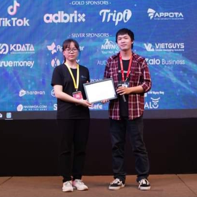

  

- Software Development Engineer in Test, Tracer Management Systems Limited.
- Master student, Faculty of Information Technology, University of Science, Vietnam National University.

## Contact:
- Email: [thuduyen07@gmail.com](mailto:thuduyen07@gmail.com)
- LinkedIn: [Duyen Nguyen](https://www.linkedin.com/in/thuduyen07/)

## Educational Background: 
- Undergraduate student majored in Mathematics and Computer Science at Faculty of Mathematics and Computer Science, University of Science, Vietnam National University.
- Master student majored in Computer Science at Faculty of Information Technology, University of Science, Vietnam National University.

## Research field:
- Image Processing and Computer Vision

## Publications:
- Nguyen, N. T. T., **Nguyen, D. T. T.**, & Pham, T.B. (2021). Micro-expression recognition based on the fusion between optical flow and dynamic image. The 5th ICMLSC, 115-120.

## Experience:
- SDET at Joblogic.
- SDET at Security Bank Corporation.
- SDET at DHL.
- SDET at EPAM.
- Research Assistant at Intelligence Computing & Image Processing laboratory, Saigon University, Vietnam.